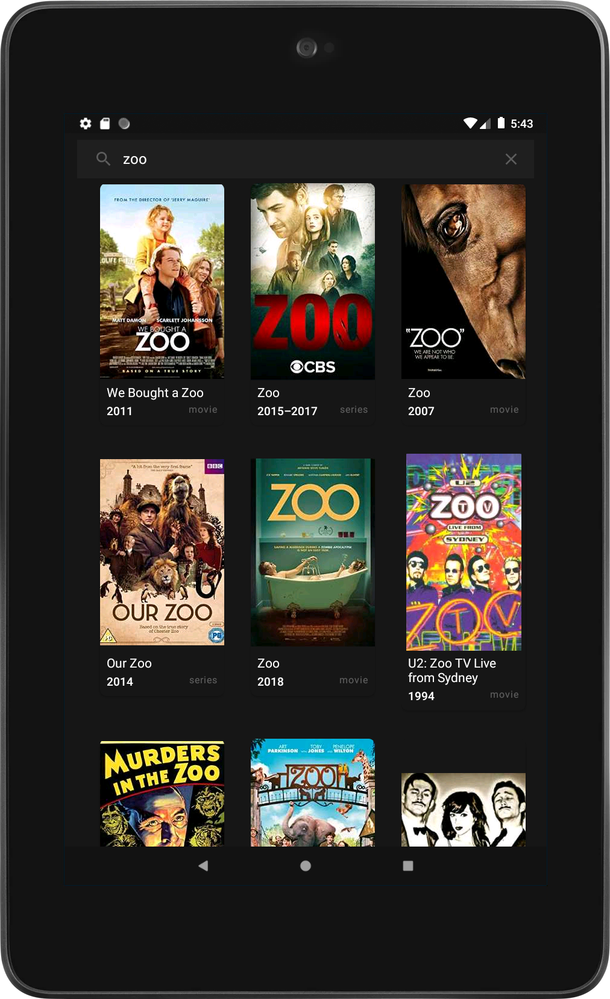

## ImdbExplorer
Android Kotlin Application For Searching Movies Information.

### Used Libraries

+ [Kotlin](https://kotlinlang.org)
+ [RxJava](https://github.com/ReactiveX/RxJava) Asynchronous Programming With Observable Pattern.
+ [Koin](https://insert-koin.io) Smart Kotlin Dependency Injection
+ [Retrofit](https://square.github.io/retrofit) HTTP Client
+ [JUnit 4](https://junit.org/junit4)

### Screenshots
#### Portrait
&nbsp;&nbsp;

#### Landscape
&nbsp;

#### Tablet
&nbsp;

#### Video

### APK File
Each release contains an APK file in Release section of github.

<< OR >>

Download latest apk file from "/built_apk" directory,
[app.apk](built_apk/app.apk)
