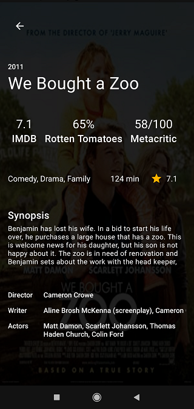
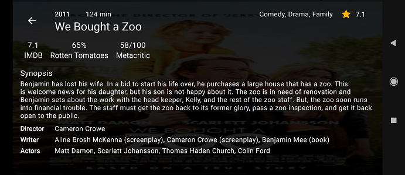
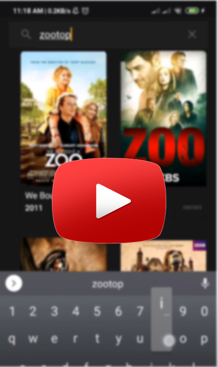

## ImdbExplorer

A simple application to search and view movies information, witch
implemented based on OMDb API(
[OMDB official site](http://www.omdbapi.com/) ).

### Technical Features

+ The screen-orientation property is **NOT LOCKED** on portrait nor
  landscape, because of reactive programming.
+ On rotating screen, API **WONT CALL** again. The last state of
  Fragment caches in its *ViewModel*, regarding to using *MVVM*
  architecture.

### Used Technologies

+ Kotlin
+ Koin as Dependency Injection that is a light weight DI in Kotlin
+ MVVM as architecture
+ RxJava and RxKotlin, to implement Observable Design Pattern.(
  [official site](https://github.com/ReactiveX/RxJava) )
+ Retrofit turns your HTTP API into a Java interface.(
  [official site](https://square.github.io/retrofit) )
+ *Error handling is so simple. Use a better solution in the real world
  application.*
+ Unit Testing with JUnit4

### Screenshots
#### Portrait
&nbsp;&nbsp;

#### Landscape
&nbsp;

#### Video

### APK File
Each release contains an APK file in Release section of github.

<< OR >>

Download latest apk file from "/built_apk" directory,
[app.apk](built_apk/app.apk)
